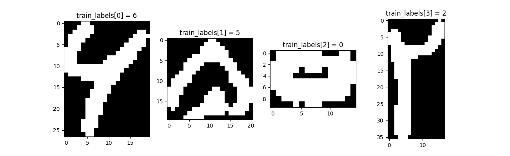

In the name of God

# Hoda Dataset Reader
This repository contains Python code for reading Hoda farsi digit dataset.

# Hoda Farsi Digit Dataset
Hoda dataset is the first dataset of handwritten Farsi digits that has been developed during an MSc. project in Tarbiat
Modarres University entitled: Recognizing Farsi Digits and Characters in SANJESH Registration Forms. This project has
been carried out in cooperation with Hoda System Corporation. It was finished in summer 2005 under supervision of Prof.
Ehsanollah Kabir.
Samples of the dataset are handwritten characters extracted from about 12000 registration forms of university entrance
examination in Iran. The dataset specifications is as follows:

* Resolution of samples: 200 dpi
* Total samples: 102,352 samples
* Training samples: 60,000 samples
* Test samples: 20,000 samples
* Remaining samples: 22,352 samples

Number of samples per each class:
* 0: 10070
* 1: 10330
* 2: 9923
* 3: 10334
* 4: 10333
* 5: 10110
* 6: 10254
* 7: 10363
* 8: 10264
* 9: 10371

For more information please refer to the paper: [Introducing a very large dataset of handwritten Farsi digits and a
study on their varieties](http://farsiocr.ir/Archive/dataset_PRL.pdf)

**This dataset is free of charge for research purposes and non commercial uses only.**

Dataset website: [http://farsiocr.ir/](http://farsiocr.ir/مجموعه-داده/مجموعه-ارقام-دستنویس-هدی)

## Dataset Samples

Samples with different writing styles in the dataset:


Samples with different qualities in the dataset:


# How to use the code
To use Hoda dataset reader, use the following code snippet:

```Python
from HodaDatasetReader import read_hoda_cdb

train_images, train_labels = read_hoda_cdb('DigitDB/Train 60000.cdb')
test_images, test_labels = read_hoda_cdb('DigitDB/Test 20000.cdb')
remaining_images, remaining_labels = read_hoda_cdb('DigitDB/RemainingSamples.cdb')
```

To run sample code type the following command at the command prompt:
```
python3 ./main.py
```

## Dependencies
* Python 3
* numpy
* matplotlib (for `main.py`)

# Output
After running `main.py` script the following output generated:

```
Reading Hoda dataset (Train)...
Reading Hoda dataset (Test)...
Reading Hoda dataset (RemainingSamples)...

type(train_images):  <class 'list'>
type(train_labels):  <class 'list'>

len(train_images):  60000
len(train_labels):  60000

----------------------------------------

type(train_images[ 0 ]): <class 'numpy.ndarray'>
type(train_labels[ 0 ]): <class 'int'>

train_images[ 0 ].shape: (27, 20)
train_images[ 0 ].shape[0] = HEIGHT: 27
train_images[ 0 ].shape[1] = WIDTH: 20
train_labels[ 0 ]: 6

----------------------------------------

type(train_images[ 1 ]): <class 'numpy.ndarray'>
type(train_labels[ 1 ]): <class 'int'>

train_images[ 1 ].shape: (20, 21)
train_images[ 1 ].shape[0] = HEIGHT: 20
train_images[ 1 ].shape[1] = WIDTH: 21
train_labels[ 1 ]: 5

----------------------------------------

type(train_images[ 2 ]): <class 'numpy.ndarray'>
type(train_labels[ 2 ]): <class 'int'>

train_images[ 2 ].shape: (10, 15)
train_images[ 2 ].shape[0] = HEIGHT: 10
train_images[ 2 ].shape[1] = WIDTH: 15
train_labels[ 2 ]: 0

----------------------------------------

type(train_images[ 3 ]): <class 'numpy.ndarray'>
type(train_labels[ 3 ]): <class 'int'>

train_images[ 3 ].shape: (36, 17)
train_images[ 3 ].shape[0] = HEIGHT: 36
train_images[ 3 ].shape[1] = WIDTH: 17
train_labels[ 3 ]: 2
```


# Links
* http://farsiocr.ir/مجموعه-داده/مجموعه-ارقام-دستنویس-هدی
* http://dadegan.ir/catalog/hoda
* https://github.com/amir-saniyan/HodaDatasetReader